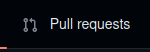

# ML-Algo-Exploration  


---
This is an open-source project established under Mbarara University Biomedical Engineering Association (MBUBESA) an association in Mbarara University of Science and Technology under the faculty of Applied Science and Technology.
It is meant to equip those interested in learning Machine Learning algorithms for medicine. You don't have to be so good at programming to participate in this project otherwise there's also a python section for those that don't know how to program in python yet as it is the main language used for our machine learning programs. Please <b>please</b> check out the <b>How to Contribute</b> section inorder to contribute otherwise let's develope sustainable machine learning models for healthcare together.
---

## How to Contribute

* Step 1: <b>Star this repo</b>  
   

* Step 2: <b>Fork it</b>  
  

* Step 3: <b>Clone it</b>   
*Use the following on your terminal* <br>
```sh
git clone https://github.com/mbubesa/ML-Algo-Exploration.git
```

* Step 4: <b>Create your branch</b>  
*Then* <br>
```sh
git checkout -b myname
```   

* Step 5: <b>Add you contribution</b>  
*Write your contribution*  

* Step 6: <b>Make a pull request</b>   
*First stage all your changes to your git*  
```sh
git add .
```   

*Commit all your changes with a good commit message*  
```sh
git commit -m "my commit message here"
```   
*Push all your changes to Github onto your forked repo*   
```sh
git push
```    

*create a pull request*   
  

*Congrats*, that's briefly what you have to do to contribute otherwise feel
free to create issues where necessary and to ask where you need help. Happy hacking.
